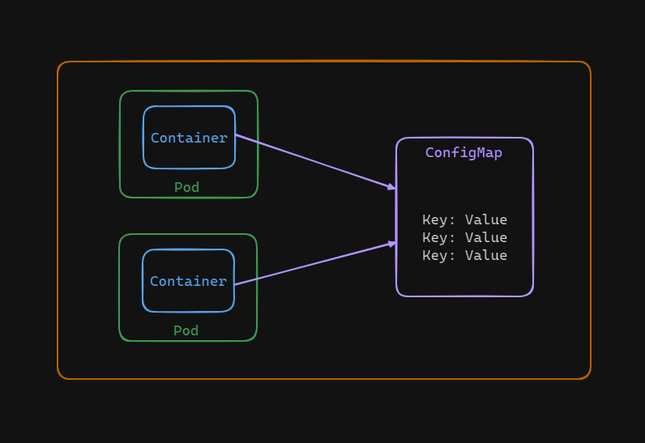

# Creating ConfigMap Object in Kubernetes

A ConfigMap in Kubernetes is like a dictionary that stores configuration data, such as environment variables, in key-value pairs. It's used to separate configuration from application code, making it easier to manage and update settings without changing the application itself.



There are two ways to create a configMap just like any other kubernetes object: 
- Imperative Approach 
- Declarative Approach 

## Task: Create a ConfigMap
Create a ConfigMap named `db-config` in Kubernetes containing environment variables for a MySQL database configuration:

Environment variables to be included:

- `MYSQL_ROOT_PASSWORD`: `abc123`

- `MYSQL_USER`: `user1`

- `MYSQL_PASSWORD`: `user1@mydb`


## Imperative Approach

Here is the format for these approach.    
```
kubectl create configmap \
    <config-name> \
    --from-literal=<key>=<value> \ 
    --from-literal=<key>=<value>
```

We can use the following command to create a configMap for out task:

```bash
kubectl create configmap db-config --from-literal=MYSQL_ROOT_PASSWORD=abc123 --from-literal=MYSQL_USER=user1 --from-literal=MYSQL_PASSWORD=user1@mydb
```
This will create the required configMap.
    
## Declarative Approach
1. Create a file named `config-map.yaml` using vim/nano and define the YAML manifest:
    ```yaml
    apiVersion: v1
    kind: ConfigMap
    metadata:
        name: db-config
    data:
        MYSQL_ROOT_PASSWORD: abc123
        MYSQL_USER: user1
        MYSQL_PASSWORD: user1@mydb
    ```
    
2. Then run the following command: 
    ```bash
    kubectl create -f config-map.yaml
    ```


## Verifying the configmap

We can view the created configMaps: 
    
```bash
kubectl get configmap
```

Expected result:


To see the details of this configMap use the following command:

```bash
kubectl describe configmap db-config
```

Expected result:

