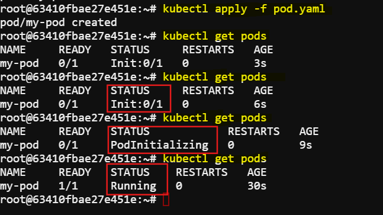

# Init Containers in Kubernetes

Init Containers are specialized containers that run before the main application containers in a Kubernetes Pod. These containers can execute setup scripts or utilities not included in the app's image, ensuring the environment is properly configured before the main containers start. 

### Key Characteristics
- **Sequential Execution:** Init containers run to completion one after another. Each init container must finish successfully before the next one begins.
- **Restart Policy:** If an init container fails, Kubernetes' kubelet will restart it until it succeeds. For Pods with a restartPolicy of Never, a failing init container causes the entire Pod to fail.


## Task


- Create a Pod named `my-pod` with an `NGINX` container.
- Add an init container named `my-init` using the `BusyBox` image.
- Configure the init container to update the content of `/usr/share/nginx/htm`l with `"hello worldpo=="`.
- Verify that the NGINX container serves the content created by the init container.


##  Create a Pod with Containers and Volume Mount

Open `pod.yaml` in `vim` text editor and modify it as follows:

```yaml
apiVersion: v1
kind: Pod
metadata:
  creationTimestamp: null
  labels:
    run: my-pod
  name: my-pod
spec:
  containers:
  - image: nginx
    name: nginx
    resources: {}
    volumeMounts:
    - name: demo
      mountPath: /usr/share/nginx/html
  initContainers:
  - name: my-init
    image: busybox:1.28
    command: ['sh', '-c', 'echo "hello world" > /tmp/index.html']
    volumeMounts:
    - name: demo
      mountPath: "/tmp/"
  dnsPolicy: ClusterFirst
  volumes:
  - name: demo
    emptyDir: {}
  restartPolicy: Always
status: {}
```

Apply the modified Pod configuration using kubectl:

```bash
kubectl apply -f pod.yaml
```

If we immediately use the command multiple times:

```bash
kubectl get pods
```

We will see the changes in `STATUS`.

Expected output:



## Verify the Init Container Execution
Exec into the running Pod and check if the NGINX container is serving the content created by the init container:

```bash
kubectl exec -it my-pod -- sh
```

Inside the Pod, run the following command:

```bash
curl localhost
```

You should see the output `"hello world"`.

Here is the expected result:

