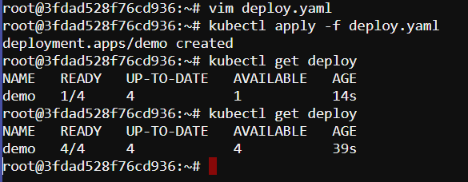
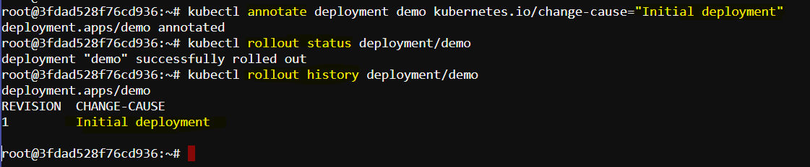
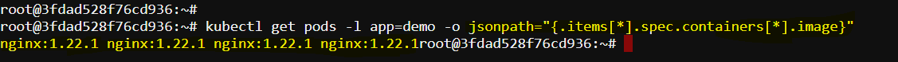
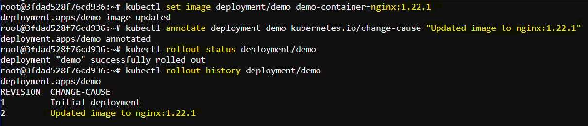
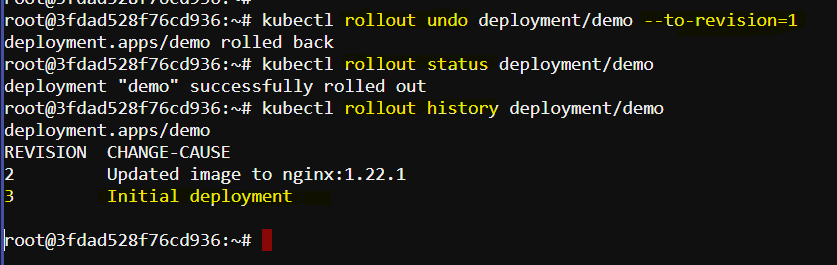
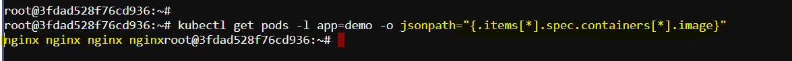

# Record and rollback deployment

## Task
Create a deployment with these following criteria.

- name=demo
- image=nginx
- replicas=4

Update the image to `nginx:1.22.1` and then revert back to the `first` revision.

## Solution

To accomplish this task, we have to follow and execute these steps:

### Step 1: Create the Initial Deployment

First, we have to create a deployment with the name `demo`, using the `nginx` image, and set the replicas to `4`. Then save the following YAML configuration to a file named `deploy.yaml`.

```yaml
apiVersion: apps/v1
kind: Deployment
metadata:
  name: demo
spec:
  replicas: 4
  selector:
    matchLabels:
      app: demo
  template:
    metadata:
      labels:
        app: demo
    spec:
      containers:
        - name: demo-container
          image: nginx
          ports:
            - containerPort: 80
```

Now we can apply this configuration using `kubectl apply`:

```sh
kubectl apply -f deploy.yaml
```

### Step 2: Verify the Deployment

Now we have to ensure that the deployment is created successfully and the pods are running:

```sh
kubectl get deployments
kubectl get pods
```



### Step 3: Annotate the Initial Deployment

To record the inital or first history, we can manually add an `annotation` for the initial deployment:

```sh
kubectl annotate deployment demo kubernetes.io/change-cause="Initial deployment"
```



### Step 4: Update the Deployment Image

Next, update the deployment image to `nginx:1.22.1`:

```sh
kubectl set image deployment/demo demo-container=nginx:1.22.1
```

Annotate the deployment with the `change cause`:

```sh
kubectl annotate deployment demo kubernetes.io/change-cause="Updated image to nginx:1.22.1"
```

### Step 5: Verify the Update

We can verify the update by using these commands:

```sh
kubectl get pods -l app=demo -o jsonpath="{.items[*].spec.containers[*].image}"
```




### Step 6: Check Deployment History

To check the revision history of the deployment to see the changes, run:

```sh
kubectl rollout status deployment/demo
```

```sh
kubectl rollout history deployment/demo
```

This will show the revisions and their change causes.



### Step 7: Rollback to the First Revision

Now, our task is to rollback the deployment to the first revision:

```sh
kubectl rollout undo deployment/demo --to-revision=1
```

### Step 8: Verify the Rollback

Verify that the rollback has been successful and the deployment is using the original image:

```sh
kubectl rollout status deployment/demo
kubectl describe deployment demo
```



### Detailed Verification

To ensure everything is correct, we can check the image of the running pods:

```sh
kubectl get pods -l app=demo -o jsonpath="{.items[*].spec.containers[*].image}"
```

This should output `nginx`. 



This ensures that we have successfully rollback to the previous version.
