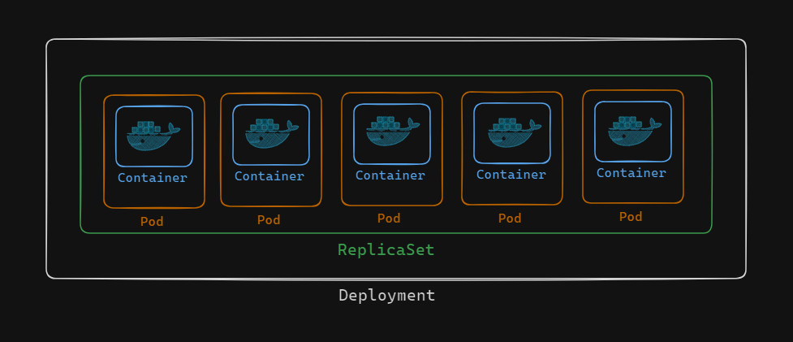
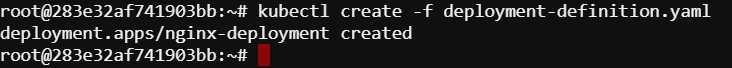
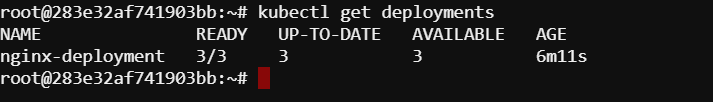
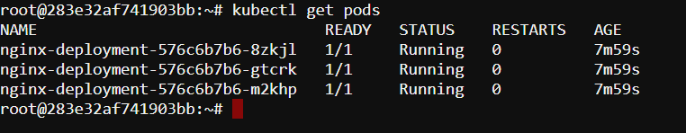

# Understanding Kubernetes Deployment Object

A Kubernetes deployment manages a set of identical pods, ensuring they run and scale as needed. Under the hood, it uses a ReplicaSet to maintain the desired number of replicas of a pod template. So, while a ReplicaSet ensures a specified number of pod replicas are running, a deployment manages updates to that set, making it easier to handle changes and rollbacks in your application.



In this example, we have illustrated the relationship between a Deployment, a ReplicaSet, and its
controlled replicas.

## Create a Kubernetes Deployment object

1. Install vim to edit/create the deployment menifest:
    ```
    sudo apt update
    sudo apt install vim
    ```

2. Create and open a yaml file for deployment definition: 

    ```
    vim deployment-definition.yaml
    ```

    Here our file name is `deployment-definition.yaml`.

3. Here is a YAML file. This YAML defines a Kubernetes Deployment named "nginx-deployment" that ensures three replicas of the nginx container are running, each exposing port 80.

    ```
    apiVersion: apps/v1
    kind: Deployment
    metadata:
    name: nginx-deployment
    spec:
    replicas: 3
    selector:
        matchLabels:
        app: nginx
    template:
        metadata:
        labels:
            app: nginx
        spec:
        containers:
        - name: nginx
            image: nginx:latest
            ports:
            - containerPort: 80

    ```

    [To go to insert mode press `i`. To save and exit vim, press `ctrl+c` then type `:wq` as the command.]

4. You can check the content of the file (optional):
    ```
    cat deployment-definition.yaml
    ```
    
5. Create the deployment:

    ```
    kubectl create -f deployment-definition.yaml
    ```

    The expected output:
    

You have successfully created the deployment!


## List the Deployment and their Pods

Use the following command to list the Deployment:

```
kubectl get deployments
```

The expected output:



Use the following command to list the Pods:

```
kubectl get pods
```

The expected output:




## Delete the Deployment

Use the following command to delete the Deployment:

```
kubectl delete deployment nginx-deployment
```

The expected output:

