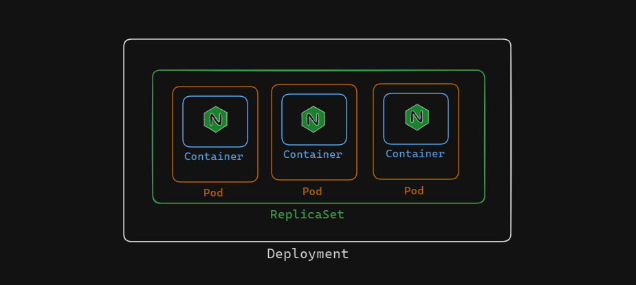
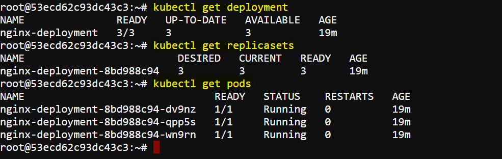
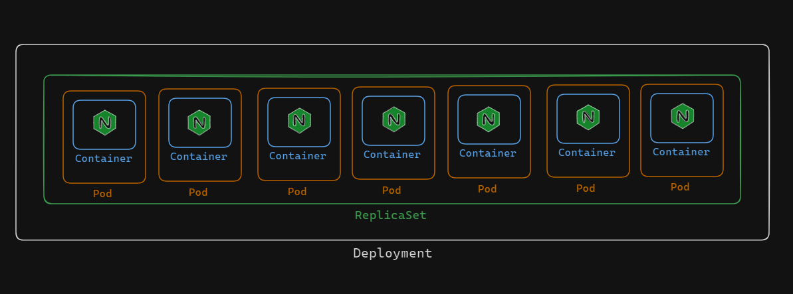
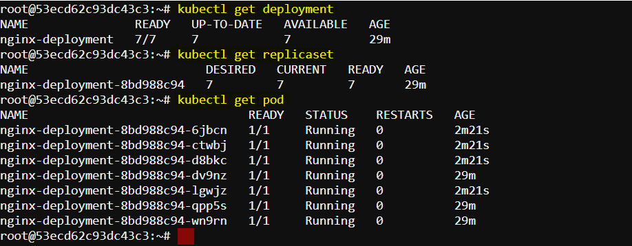

# Scaling the kubernetes deployment 

A critical feature of Kubernetes that enables users to effectively manage the performance, availability, and resource use of their applications is scaling. Kubernetes provides strong mechanisms for application scaling whether handling changing workloads, traffic patterns, or changing business needs. Let's look at the task below to understand scaling.


## Creating a deployment



Use the following command to create a deployment:

```
kubectl create deployment nginx-deployment --image=nginx:latest --replicas=3 --port=80
```

It will create a deployment with a replicaset of the specified number of replicas. It uses the nginx image for the containers. we can see the created deployment, replicaset and pods using the following commands:

```
kubectl get deployment
kubectl get replicasets
kubectl get pods
```

Here's the expected output:



## Scale the deployment
### Task:  Scale the Deployment to seven replicas using the scale command. Ensure that the correct number of Pods exist.



- Here we can scale the deployment using the scale command:

    ```
    kubectl scale deployment nginx-deployment --replicas=7
    ```

    Now, if we see the deployment, replicaset and pods using the following commands:

    ```
    kubectl get deployment
    kubectl get replicasets
    kubectl get pods
    ```

    we will get the following output:
    

    In the output, we can see that the number of pods in this deployment scaled upto seven.


- We can again scale down the deployment if we want. Here is a command to scale down the deployment to four replicas.

    ```
    kubectl scale deployment nginx-deployment --replicas=4
    ```

    Now, if we check the pods, we will see that the number of pods in this deployment is four.
