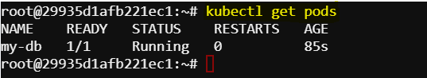

# Passing Environment Variables to Pods in Kubernetes

Environment variables are commonly used to configure applications and provide runtime parameters without modifying the application code or container image. There are many ways to set environment variables such as using plain key-value pairs, using configMaps, using secrets etc. In this exercise we will pass environment variables using simple key-value pairs.

There are two ways of creating pods with environment variables: imperatively and declaratively. We can use any one of this approach.

## Task
Create a Kubernetes Pod named "my-db" using the MySQL image. Define two environment variables within the container:

`MYSQL_ROOT_PASSWORD` set to `abc123`

`MYSQL_USER` set to `user1`

`MYSQL_PASSWORD` set to `user1@mydb`

## Imperative Approach

The following command creates a Kubernetes Pod named "my-db" with the given environment variables:

```
kubectl run my-db --image=mysql:latest --env="MYSQL_ROOT_PASSWORD=abc123" --env="MYSQL_USER=user1" --env="MYSQL_PASSWORD=user1@mydb"
```


## Declarative Approach

1. Create a YAML menifest file for the pod with given environment variables `pod-definitions.yaml`:

    ```
    apiVersion: v1
    kind: Pod
    metadata:
        name: my-db
    spec:
        containers:
        - name: mysql-container
          image: mysql:latest
          env:
          - name: MYSQL_ROOT_PASSWORD
            value: abc123
          - name: MYSQL_USER
            value: user1
          - name: MYSQL_PASSWORD
            value: user1@mydb
    ```

2. Create a pod with this YAML manifest using the following command:
    ```
    kubectl create -f pod-definitions.yaml
    ```

## Verifying the pod

Use the following command to see the created pod:
```
kubectl get pod
```
Expected result:



Use the following command to see the pod details:
```
kubectl describe pod my-db
```
