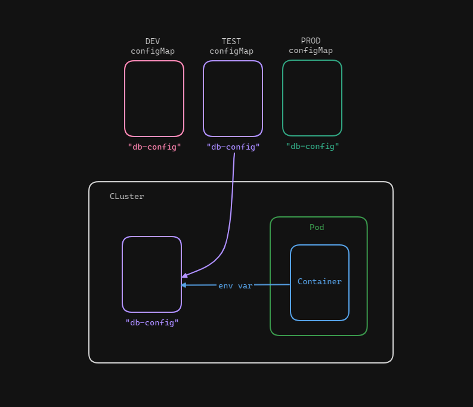

#  Consuming a ConfigMap as Environment Variables

In this session, we will create a ConfigMap that is to store a bunch of key-value strings and inject them as environment variables into our Pod.

## How does a ConfigMap work?

A ConfigMap is a dictionary of key-value pairs that store configuration settings for our applications.
First, create a ConfigMap in our cluster. We can use a YAML definition file to create it.
Second, we consume to ConfigMap in our Pods and use its values as env variables.



## Creating a ConfigMap

Here we are using the imperative approach to create a ConfigMap. The following command will create a ConfigMap named `db-config` with the following configuration:

`MYSQL_ROOT_PASSWORD`: `abc123`

`MYSQL_USER`: `user1`

`MYSQL_PASSWORD`: `user1@mydb`

```
kubectl create configmap db-config --from-literal=MYSQL_ROOT_PASSWORD=abc123 --from-literal=MYSQL_USER=user1 --from-literal=MYSQL_PASSWORD=user1@mydb
```

## Injecting into pods

Now we need to create a YAML manifest file `pod-definition.yaml` that contains the pod definitions. Here is the pod definition file with env variable form configMap:

```
apiVersion: v1 
kind: Pod 
metadata:
  name: my-db
  labels:
    name: my-db
spec:
  containers:
  - name: my-db
    image: mysql
    envFrom:
    - configMapRef:
        name: db-config
```

There is another way to inject into the pod definition. Here is an example of how to inject into the pod:

```
apiVersion: v1 
kind: Pod 
metadata:
  name: my-db
  labels:
    name: my-db
spec:
  containers:
  - name: my-db
    image: mysql
    env:
    - name: MYSQL_ROOT_PASSWORD
      valueFrom:
        configMapKeyRef:
          name: db-config
          key: MYSQL_ROOT_PASSWORD
    
    - name: MYSQL_USER
      valueFrom:
        configMapKeyRef:
          name: db-config
          key: MYSQL_USER

    - name: MYSQL_PASSWORD
      valueFrom:
        configMapKeyRef:
          name: db-config
          key: MYSQL_PASSWORD
```

Run the following command to create the pod:
```
kubectl create -f pod-definition.yaml
```