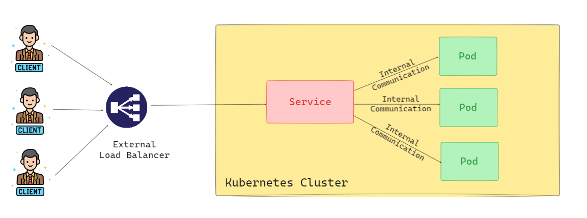
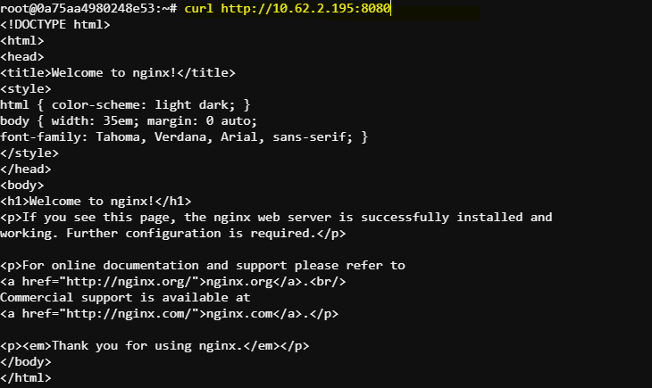

# Kubernetes Service Using LoadBalancer

## Load Balancer



A Load Balancer is a service type that provides external access to a set of pods in a cluster. It distributes incoming traffic among the pods to ensure high availability, scalability, and reliability of the application running in the cluster.

Load balancing becomes necessary in various scenarios, primarily when we have multiple instances of our application running simultaneously, and we want to distribute incoming traffic among them efficiently.

## Task: Accessing Kubernetes Services via LoadBalancer

This guide outlines the steps to create a nginx-deployment service and accessing the service using LoadBalancer. The final goal is to access the targeted nginx-pod and curl the application using LoadBalancer externally using a external IP address that can be used to access the application from outside the Kubernetes cluster.

## Prerequisites

Install vim for creating YAML files in the system.

```bash
sudo apt update
sudo apt install vim
```

## Required Steps

### 1. Create Nginx-deployment File

Let's create a Nginx-deployment file with three replica of pods running:

```yaml
apiVersion: apps/v1
kind: Deployment
metadata:
  name: nginx-deployment
spec:
  replicas: 3
  selector:
    matchLabels:
      app: nginx
  template:
    metadata:
      labels:
        app: nginx
    spec:
      containers:
      - name: nginx
        image: nginx:latest
        ports:
        - containerPort: 80
```

use ``vim nginx-deployment.yaml`` and write the yaml file pressing ``i`` for INSERT and exit using ``esc`` and ``:wq``.

Now, see the yaml file using ``cat nginx-deployment.yaml``.

### 2. Create Nginx-service File

Let's write a YAML manifest file for the Nginx-deployment file which specifies the service type as LoadBalancer and service port at 8080, allowing external access to the service.

```yaml
apiVersion: v1
kind: Service
metadata:
  name: nginx-service
spec:
  type: LoadBalancer
  selector:
    app: nginx
  ports:
    - port: 8080
      targetPort: 80
      nodePort: 30001
```
use ``vim nginx-service.yaml`` and write the yaml file pressing ``i`` for INSERT and exit using ``esc`` and ``:wq``.

Now, see the yaml file using ``cat nginx-service.yaml``.

### 3. Create Deployment and Service

To create the deployment and service, run the following commands:

```bash
kubectl apply -f nginx-deployment.yaml
kubectl apply -f nginx-service.yaml
```

### 4. Check Deployment and Service

Check the status of the deployment using:

```bash
kubectl get deployments
```

Check the status of the service using:

```bash
kubectl get services
```

We can also get all the information by using ``kubectl get all``


If the pods and services are runnung, we are ready for accessing Nginx using LoadBalancer.

### 5. Get the External IP

To get the External IP address of the node in a Kubernetes cluster, we can use the kubectl command-line tool to fetch this information. Here's how:

```bash
kubectl get services
```


### 6. Curl using LoadBalancer

We can access the Nginx server through any of our Kubernetes cluster external IP addresses.

```bash
curl http://10.62.2.195:8080
```

## Expected Output


