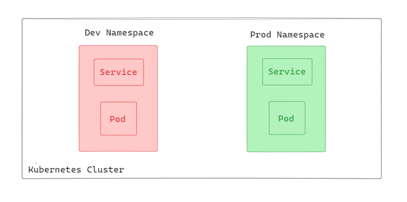
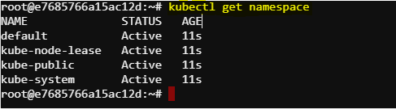

# Kubernetes Namespace

Namespaces in Kubernetes provide a mechanism for isolating groups of resources within a single cluster. They are intended for use in environments with many users spread across multiple teams, or projects. Namespaces help to divide cluster resources between multiple users in a way that is logically separated.



In this diagram there a Kubernetes cluster divided into two primary namespaces: ``dev`` and ``prod``. Each namespace serves a distinct purpose, with dev focusing on development and testing, while prod emphasizes stability and security with stricter resource quotas. These two namespaces help isolating resources between dev and prod. 

## Initial Namespaces


Kubernetes starts with four initial namespaces:
-   default
-   kube-node-lease
-   kube-public
-   kube-system

We can see the initial namespaces using the following command:

```bash
kubectl get namespace
```

