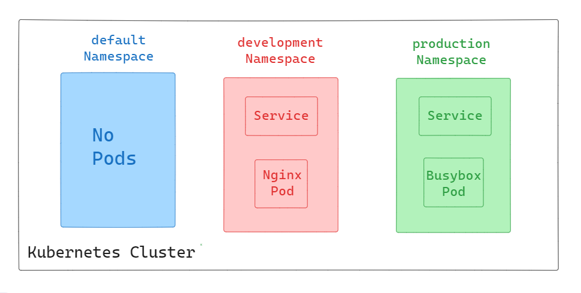

# Switching Contexts Between Kubernetes Namespaces

Namespaces in Kubernetes provide a way to divide cluster resources between multiple users. They are intended for use in environments with many users spread across multiple teams or projects. Understanding how to switch between contexts allows us to control and manage our Kubernetes resources effectively.

