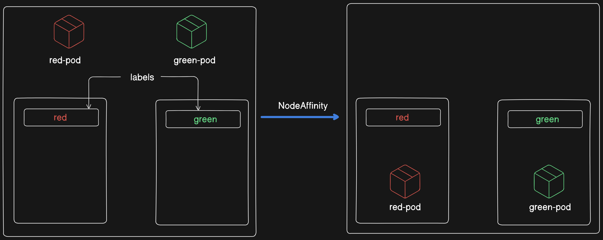
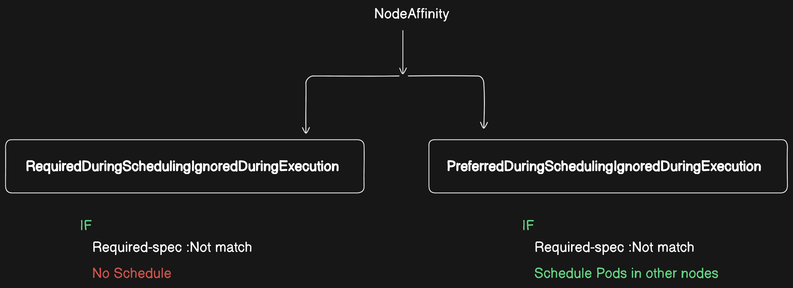
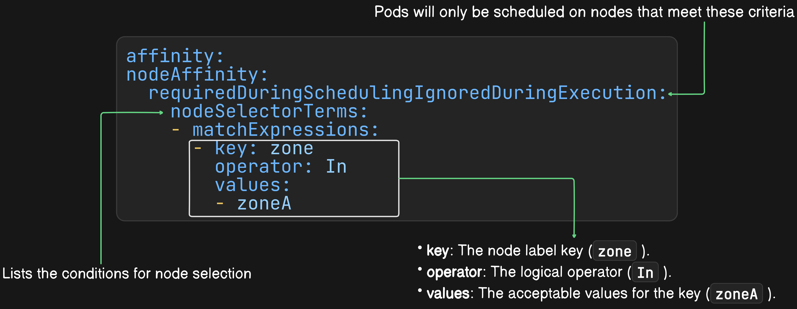

# NodeAffinity in Kubernetes

`NodeAffinity` is a scheduling feature in Kubernetes that allows us to constrain which nodes our pods are eligible to be scheduled on based on node labels. It allows us to specify rules that determine which nodes are suitable for your pods, helping ensure they are placed on nodes with certain desired characteristics.



## Types of NodeAffinity

There are two types of NodeAffinity:

- RequiredDuringSchedulingIgnoredDuringExecution

- PreferredDuringSchedulingIgnoredDuringExecution



## Task

We have a Kubernetes cluster with nodes labeled to indicate their geographic zones, such as zoneA and zoneB. We want to ensure that a particular pod is only scheduled on nodes within zoneA.

## Label Nodes

Label Node 1 with `zone=zoneA`:

```
kubectl label nodes <node-1> zone=zoneA
```

Label Node 2 with `zone=zoneB`:

```
kubectl label nodes <node-2> zone=zoneB
```

Replace `<node-1>` and `<node-2>`with the actual names of desired nodes.


## Create a Pod Specification with NodeAffinity (`pod1.yaml`)

```yaml
apiVersion: v1
kind: Pod
metadata:
  name: mypod
spec:
  affinity:
    nodeAffinity:
      requiredDuringSchedulingIgnoredDuringExecution:
        nodeSelectorTerms:
        - matchExpressions:
          - key: zone
            operator: In
            values:
            - zoneA
  containers:
  - name: mycontainer
    image: nginx
```



## Apply the Pod Specification

```
kubectl apply -f pod1.yaml
```

## Verify the Pod Placement

After applying the pod specification, verify that the pod has been scheduled on a node labeled with `zone=zoneA`.

```
kubectl get pods -o wide
```

Check the NODE column to ensure that `mypod` is running on a node labeled `zone=zoneA`

<!--  -->