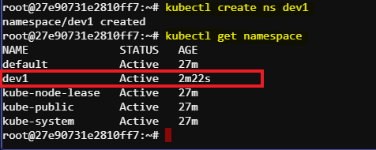

# Create a Pod with Specific Service Account

## Service Account

A Service Account in Kubernetes is an identity used by processes running in a pod to interact with the Kubernetes API. It provides an authentication mechanism for pods to communicate with the Kubernetes cluster and access resources or perform operations according to assigned permissions. 

When we create a cluster, Kubernetes automatically creates a ServiceAccount object named ``default`` for every namespace in our cluster. The ``default`` service accounts in each namespace get no permissions by default other than the default API discovery permissions that Kubernetes grants to all authenticated principals if role-based access control (RBAC) is enabled. If we delete the ``default`` ServiceAccount object in a namespace, the control plane replaces it with a new one.


If we deploy a Pod in a namespace, and we don't manually assign a ServiceAccount to the Pod, Kubernetes assigns the ``default`` ServiceAccount for that namespace to the Pod.

## Task

This lab provides a step-by-step guide to deploy a Kubernetes Pod using the ``nginx`` image and a service account named ``demo-sa`` in the ``dev1`` namespace.

<!-- image -->

## Solution

In this lab, we will create a namespace, service account, and deploy an ``nginx`` pod using the ``demo-sa`` service account in the dev1 namespace. This setup will ensure that the pod runs with the specified permissions provided by the service account.

## Create the Namespace

At first, we create a ``dev1`` namespace using:

```bash
kubectl create ns dev1
```
Check whether the namespace is created using:

```bash
kubectl get namespace
```



## Create the Service Account ``demo-sa``

Create a service account named ``demo-sa`` in the ``dev1`` namespace using:

```bash 
kubectl create serviceaccount demo-sa -n dev1
```

See all the service accounts in the ``dev1`` namespace using:

```bash
kubectl get serviceaccounts -n dev1
```


## Create the Pod using this Service Account

```bash
kubectl run demo --image=nginx -n dev1 --dry-run=client -o json \
--overrides='{"spec": {"serviceAccountName": "demo-sa"}}' | kubectl apply -f -
```

This command will create a Kubernetes deployment named ``demo`` using the ``nginx`` image, but with the additional configuration to specify a service account (``demo-sa``) in the ``dev1`` namespace.

``--overrides='{"spec": {"serviceAccountName": "demo-sa"}}'`` This JSON object specifies that the deployment should use the service account named ``demo-sa`` and override ``spec`` fields in the generated JSON output.

## Check the Pod

Check if the pod is running or not using:

```bash
kubectl get pods -n dev1
```

Show the service account associated with the deployment using:

```bash
kubectl get pod demo -n dev1 -o yaml | grep serviceAccount
```

This command retrieves the YAML representation of the ``demo`` pod and filters out lines containing ``serviceAccount``.


## Cleanup

To clean up the resources created in this lab, delete the namespace using the following command:

```bash
kubectl delete ns dev1
```
