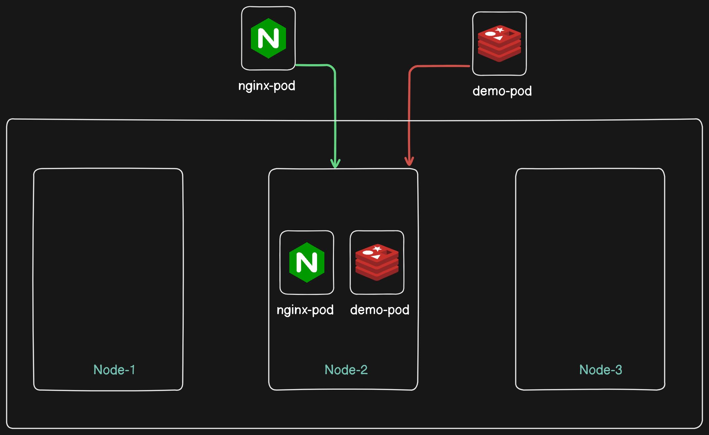
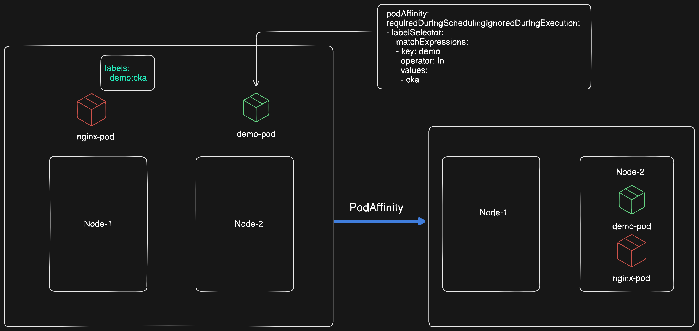

# Scenario 9 - Scheduling without nodeName and NodeSelector

## Task

Create two pods, first with `name=nginx` and `image=nginx`, second with `name=demo` and
`image=redis`. Make sure that they end up on the same node without using `nodeName` or
`nodeselector`.



 ## Solution

 To ensure that the two pods (nginx and demo) end up on the same node,
 - we need to use `PodAffinity` (Not `NodeAffinity`)
 - we need to configure the nginx pod with a label that the demo pod will use to find the nginx pod and schedule itself on the same node. 

## NodeAffinity Vs PodAffinity

`NodeAffinity` and `PodAffinity` are both important features in Kubernetes, but they serve different purposes. `NodeAffinity` influences pod scheduling based on node characteristics, while `PodAffinity` influences pod scheduling based on the presence or absence of other pods.

### Purpose:

 - **NodeAffinity**: It's used when we want to influence which nodes our pod should be scheduled on based on node labels.

 

 - **PodAffinity**:  We might want to ensure that related services are scheduled on the same node for better performance or on different nodes for fault tolerance.

 

 ##  Pod Configuration

First, create the nginx pod and label it so that the demo pod can find it.

```yaml
apiVersion: v1
kind: Pod
metadata:
  labels:
    demo: cka
  name: nginx
spec:
  containers:
  - image: nginx
    name: nginx
```

Create the demo pod and use Pod Affinity to ensure it gets scheduled on the same node as the nginx pod.

```yaml
apiVersion: v1
kind: Pod
metadata:
  name: demo
spec:
  affinity:
    podAffinity:
      requiredDuringSchedulingIgnoredDuringExecution:
      - labelSelector:
          matchExpressions:
          - key: demo
            operator: In
            values:
            - cka
        topologyKey: kubernetes.io/hostname
  containers:
  - image: redis
    name: demo
```

## Apply YAML files to create pods

```
kubectl apply -f pod1.yaml
kubectl apply -f pod2.yaml
```

## Verify pods are scheduled on the same node

```
kubectl get pods -o wide
```
Expected Outputs:

//image


