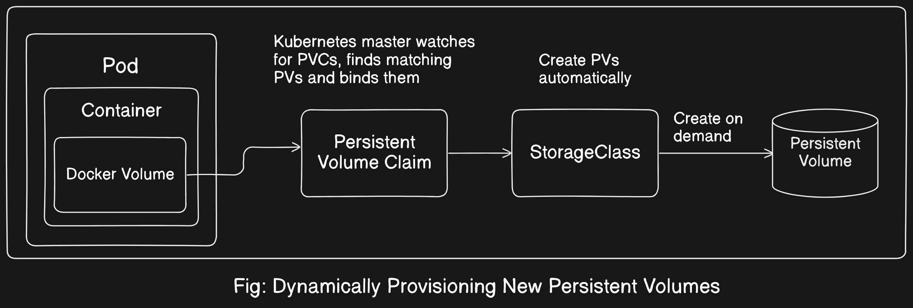
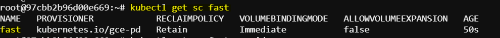
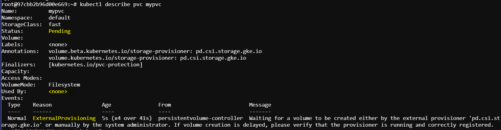
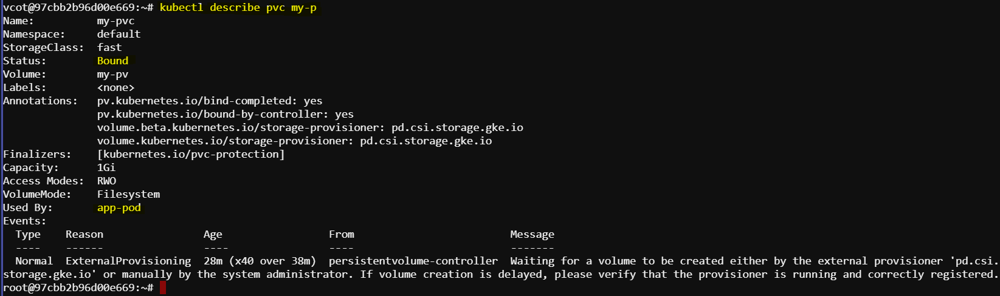

# Kuberenetes StorageClass

In Kubernetes, a `StorageClass` provides a way to describe the "classes" of storage available for use in a cluster. Different classes might map to quality-of-service levels, backup policies, or other storage attributes. This allows cluster administrators to define different tiers of storage, and developers to request the appropriate class of storage for their applications.



<details>
  <summary>Key Concepts about StorageClass</summary>
  
  1. **Dynamic Provisioning**:
     - `StorageClass` is used to enable dynamic provisioning of PersistentVolumes (PVs). When a PersistentVolumeClaim (PVC) requests storage, the associated `StorageClass` provisions the PV automatically.

  2. **Attributes**:
     - `provisioner`: This field specifies the type of the provisioner to use (e.g., `kubernetes.io/aws-ebs` for AWS Elastic Block Store, `kubernetes.io/gce-pd` for Google Compute Engine Persistent Disks).
     - `parameters`: These are key-value pairs that are passed to the provisioner and can include details such as disk type, replication factor, or other provider-specific attributes.
     - `reclaimPolicy`: This determines what happens to the PV when a PVC is deleted. Common values are `Retain`, `Recycle`, and `Delete`.
     - `volumeBindingMode`: This specifies when volume binding and dynamic provisioning should occur. Possible values are `Immediate` and `WaitForFirstConsumer`.

</details>

## 1. Create a StorageClass:

Storage classes can be created declaratively only with the help of a YAML manifest. At a minimum, we need to declare the provisioner. All other attributes are optional.

```bash
vim sc.yaml
```

```yaml
apiVersion: storage.k8s.io/v1
kind: StorageClass
metadata:
  name: fast
provisioner: pd.csi.storage.gke.io
parameters:
  type: pd-ssd
reclaimPolicy: Retain
volumeBindingMode: Immediate
```

```bash
kubectl apply -f sc.yaml
```

Here,

- **`provisioner`**: Specifies the storage provider, in this case, GCE Persistent Disks.
- **`parameters`**: Defines the type of storage (e.g., SSD).
- **`reclaimPolicy`**: Indicates that the PV should be retained after the PVC is deleted.
- **`volumeBindingMode`**: Immediate binding and provisioning when a PVC is created.

## 2. Create a PersistentVolumeClaim (PVC)

Provisioning a PersistentVolume dynamically requires the assignment of the `storageClass` during the creation of `PeristentVolumeClaim`.

```bash
vim pvc.yaml
```

```yaml
apiVersion: v1
kind: PersistentVolumeClaim
metadata:
  name: my-pvc # Corrected to match the Pod reference
spec:
  accessModes:
    - ReadWriteOnce
  resources:
    requests:
      storage: 1Gi
  storageClassName: fast # Assignment of the storage class
```

```bash
kubectl apply -f pvc.yaml
```

- **`storageClassName`**: Specifies that this PVC should use the `fast` StorageClass.

A corresponding `PersistentVolume` object will be created only if the storage class can provision an appropriate PersistentVolume through its `provisioner`. It's crucial to note that Kubernetes does not generate an `error or warning message` if this does not happen.

## 3. Mount the PVC to a Pod

The steps for mounting the PersistentVolumeClaim from a Pod are the same as for static and dynamic provisioning.

```bash
vim pod.yaml
```

```yaml
apiVersion: v1
kind: Pod
metadata:
  name: app-pod
spec:
  containers:
    - name: my-app
      image: alpine
      command: ["/bin/sh"]
      args: ["-c", "while true; do sleep 60; done;"]
      volumeMounts:
        - mountPath: "/mnt/data"
          name: my-storage
  volumes:
    - name: my-storage
      persistentVolumeClaim:
        claimName: my-pvc
```

```bash
kubectl apply -f pod.yaml
```

## Verification

To get the information about the newly created storageClass:
```bash
kubectl get sc fast
```


Check the PVC status:

```bash
kubectl get pvc
```


here we can see the `status` is `pending`. The PVC is waiting for a volume to be created either by the external provisioner `pd.csi.storage.gke.io` or `manually` by the system administrator.

**Solution**

If dynamic provisioning fails, we may need to manually create a PersistentVolume that matches the PVC's requirements.

```bash
vim pv.yaml
```

```yaml
apiVersion: v1
kind: PersistentVolume
metadata:
  name: my-pv
spec:
  capacity:
    storage: 1Gi
  accessModes:
    - ReadWriteOnce
  persistentVolumeReclaimPolicy: Retain
  storageClassName: fast
  hostPath:
    path: /mnt/disks/my-disk
```

```bash
kubectl apply -f pv.yaml
```

Lets check the status of the PVC now.

```bash
kubectl get pvc
```


So after creating the PV manually, we can see the `status` is `Bound` and `Used by` the pod `app-pod`.
