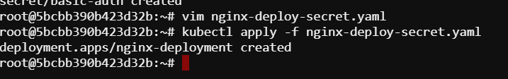
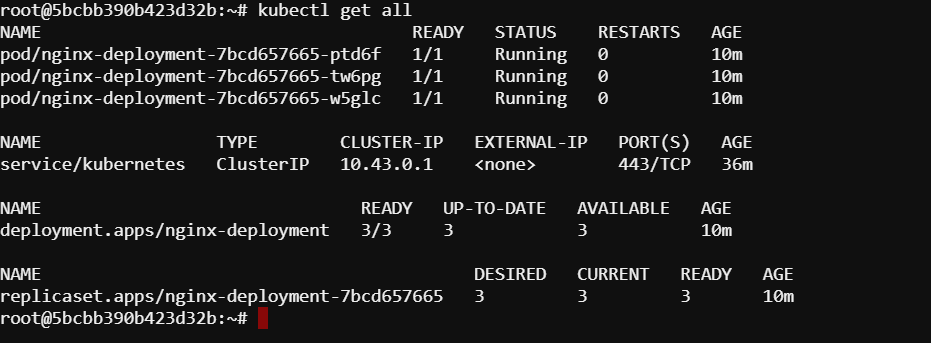
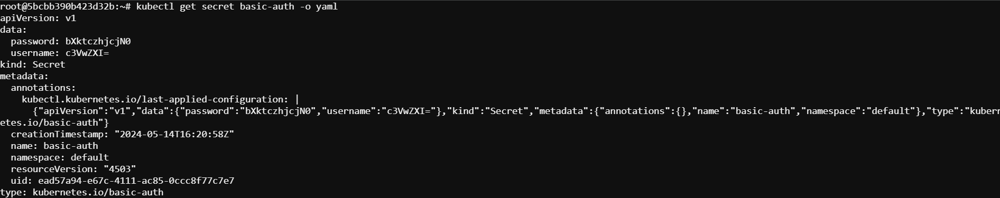

# Mounting a secret as a volume

In this lab, our task is to create a new Secret named `basic-auth` of type kubernetes.io/basic-auth. Assign the key-value pairs 
    `username=super`
    `password=my-s8cr3t`.
Mount the Secret as a volume with the path `/etc/secret` and `read-only` permissions to the Pods controlled by the Deployment.

# Steps

## 1. Create a secret

```bash
vim secret.yaml
```

```YAML
apiVersion: v1
kind: Secret
metadata:
  name: basic-auth
type: kubernetes.io/basic-auth
data:
  username: c3VwZXI=  # base64 encoded value of 'super'
  password: bXktczhjcjN0   # base64 encoded value of 'my-s8cr3t'
```

```bash
kubectl apply -f secret.yaml
```


## 2. Create the deployment

```bash
vim nginx-deploy-secret.yaml
```

```YAML
apiVersion: apps/v1
kind: Deployment
metadata:
  name: nginx-deployment
spec:
  replicas: 3
  selector:
    matchLabels:
      app: nginx
  template:
    metadata:
      labels:
        app: nginx
    spec:
      containers:
      - name: nginx
        image: nginx:1.17.0  # NGINX image
        volumeMounts:
        - name: secret-volume
          mountPath: /etc/secret
          readOnly: true
      volumes:
      - name: secret-volume
        secret:
          secretName: basic-auth
```

```bash
kubectl apply -f nginx-deploy-secret.yaml
```



## 3. Verify the Deployment and Secret

```bash
kubectl get all
```


```bash
kubectl get secret
```


## 4. View secret details

```bash
kubectl get secret basic-auth -o yaml
```


## 5. Verify Mount

To verify that the Secret is correctly mounted as a volume, we can exec into one of the Pods:

```bash
kubectl exec -it <pod_name> -- /bin/bash
```
Here, replace the `pod_name` with your pods name.

```bash
ls -1 /etc/secret
```

```bash
cat /etc/secret/username
cat /etc/secret/password
```


So, we have successfully mounted a secret as a volume with the specific path and the given requirements.


